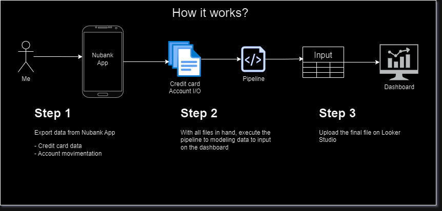

### Personal Finances Analysis

A pipeline to transform data extracted from Nubank account. The main objective is to simplify month analysis based on credit card and bank account movimentation throught a simple python pipeline that processes data exported from Nubank app or website, processes this data in a way to provide insights throught a dashboard on Looker Studio.

Tools and Technology used:
- Python 3.9.6
- Jupyter Notebook
- Pandas
- Looker Studio

Data Sources Used:
- Credit Card (after closed, day 5 of each month)
- Account Movimentation (following the same data of credit card)

 

[Dashboard Personal Finance Analysis](https://lookerstudio.google.com/u/0/reporting/d22c0111-6404-48f1-9fd3-2f2e4926aa3f/page/WHs9D)

### Steps Planned
✅ - Credit card pipeline  
✅ - Dashboard with credit card view  
🛠️ - Account movimentation pipeline  
... - Dashboard with account movimentation view  
... - Dashboard with a summary page combining credit card and account movimentation data  

### Highlights
- After 23/09/2024, Nubank will deactivate the option to download credit card files thought their website. Util they brings this functionality to mobile app it's doesn't possible to use the credit card pipeline.